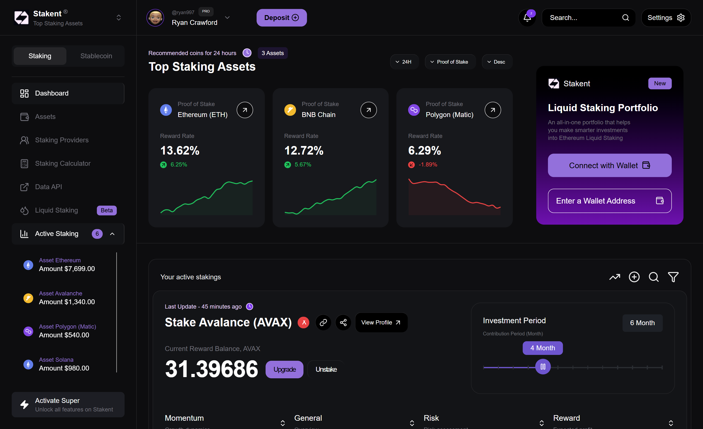

# Crypto Staking Dashboard

A modern, responsive cryptocurrency staking dashboard built with Next.js that allows users to monitor and manage their staking assets across multiple blockchain networks.



## Features

- 📊 Real-time staking metrics and analytics
- 💰 Support for multiple assets (ETH, BNB, MATIC, etc.)
- 📈 Interactive performance charts and trends
- 🔐 Secure wallet connection
- ⚡ Live reward rate tracking
- 📱 Responsive design for all devices
- 🌓 Dark mode support
- 🔄 Real-time data updates

## Tech Stack

- Next.js
- TypeScript
- Tailwind CSS
- Chart.js and react-chart for visualizations
- Material UI
- lucide-react for icons

## Prerequisites

- Node.js 16.x or later
- npm or yarn
- Git

## Getting Started

1. Clone the repository:
```bash
git clone https://github.com/Beri28/frontend-assesment.git .
cd frontend-assesment
```

2. Install dependencies:
```bash
npm install
# or
yarn install
```

3. No envinronment variables were used in this project
```

4. Run the development server:
```bash
npm run dev
# or
yarn dev
```

5. Open [http://localhost:3000](http://localhost:3000) with your browser to see the result.

## Build and Deployment

To build the application for production:

```bash
npm run build
# or
yarn build
```

To start the production server:

```bash
npm run start
# or
yarn start
```

## Deployment URLs
Vercel
- https://frontend-assesment-phi.vercel.app/

## Contributing

1. Fork the repository
2. Create your feature branch (`git checkout -b feature/amazing-feature`)
3. Commit your changes (`git commit -m 'Add some amazing feature'`)
4. Push to the branch (`git push origin feature/amazing-feature`)
5. Open a Pull Request

## Support

For support, please open an issue in the GitHub repository or contact the development team.
